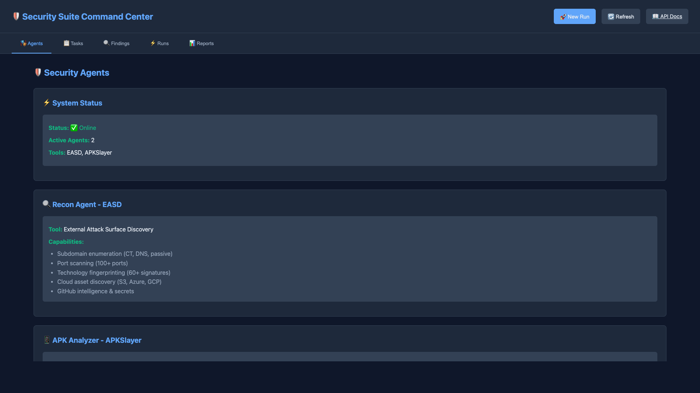
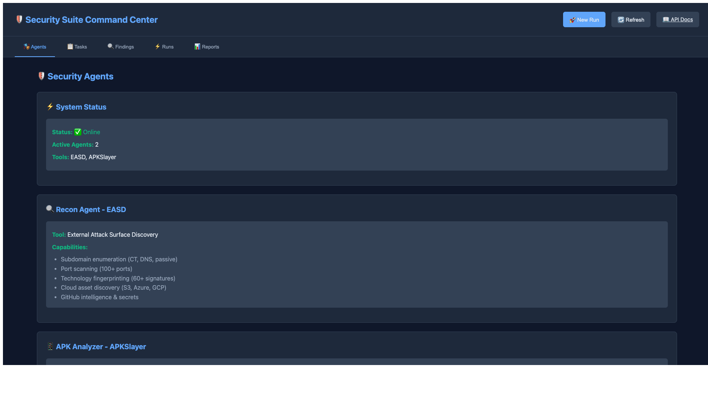
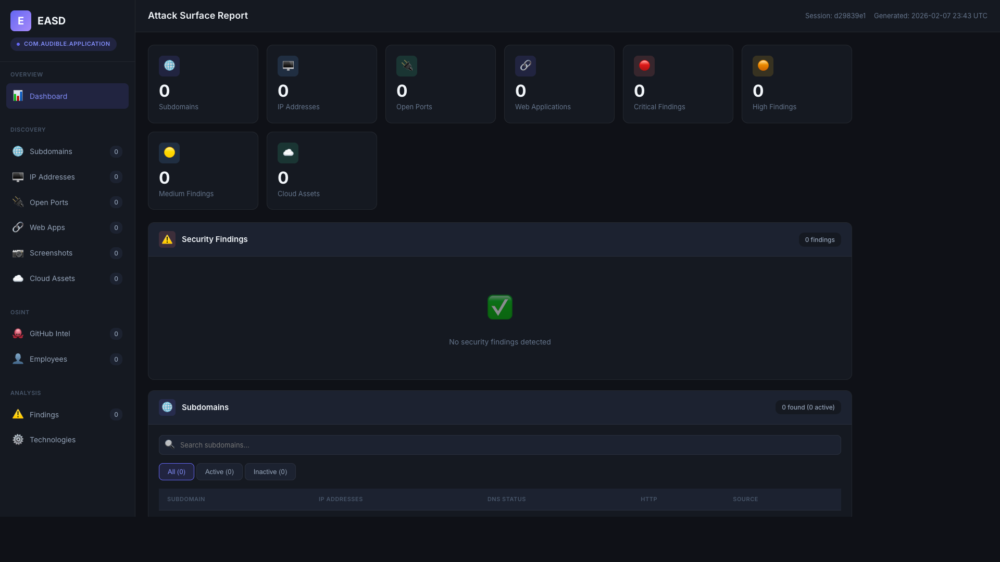
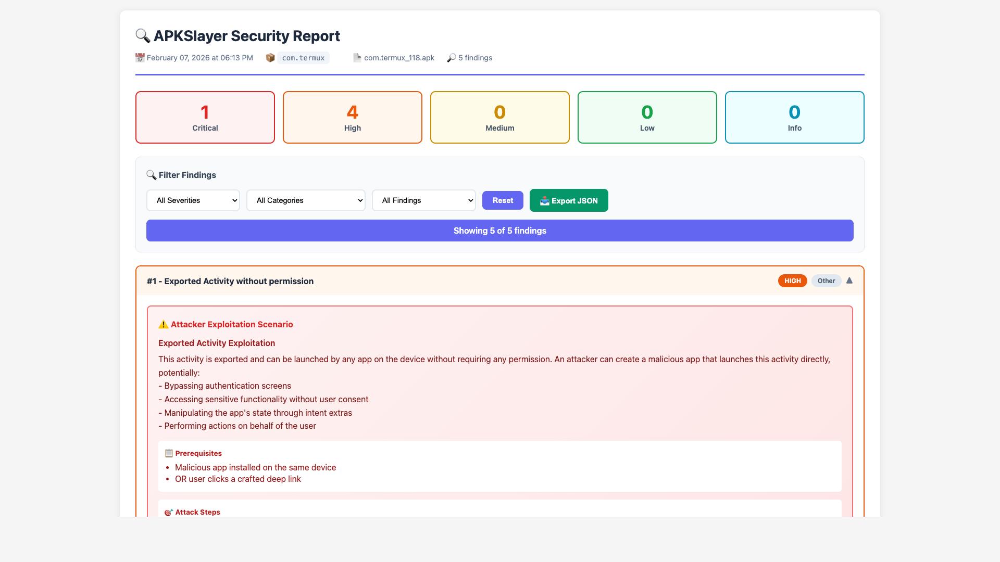
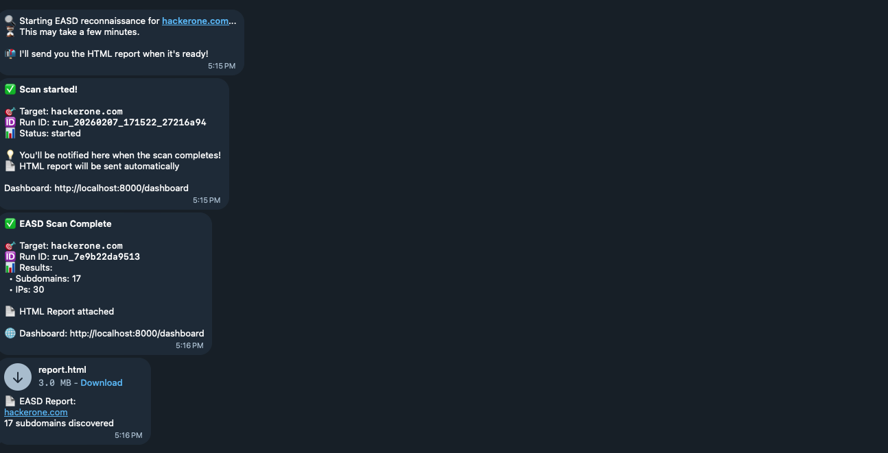

# 🛡️ Security Suite

<div align="center">


**Comprehensive Automated Security Testing Suite**

*External Attack Surface Discovery + Android APK Security Analysis*

[Features](#-features) • [Installation](#-installation) • [Usage](#-usage) • [API Docs](#-api-documentation) • [Screenshots](#-screenshots)

</div>

---

## 📋 Overview

Security Suite is an automated security testing platform that combines **EASD** (External Attack Surface Discovery) for domain reconnaissance with **APKSlayer** for Android application security analysis. Built with FastAPI and integrated with Telegram for remote operations.

### 🎯 Key Capabilities

- **🔍 Domain Reconnaissance** - Comprehensive subdomain enumeration and attack surface mapping
- **📱 APK Security Analysis** - Deep security assessment of Android applications
- **🤖 Telegram Bot Integration** - Remote scanning and file upload capabilities
- **📊 Interactive Dashboard** - Real-time monitoring and visualization
- **📄 Professional Reports** - HTML and JSON formatted security reports
- **🔄 Task Orchestration** - Intelligent agent-based workflow management

---

## ✨ Features

### EASD (External Attack Surface Discovery)
- ✅ Subdomain enumeration and discovery
- ✅ DNS record analysis
- ✅ Port scanning (100+ common ports)
- ✅ Technology stack identification
- ✅ SSL/TLS certificate analysis
- ✅ Cloud asset discovery
- ✅ GitHub intelligence & secrets scanning
- ✅ Interactive HTML reports with visualizations

### APKSlayer (Android Security Analysis)
- ✅ 77+ vulnerability pattern detection (OWASP Mobile Top 10)
- ✅ Manifest analysis and permission review
- ✅ Intent, WebView, and ContentProvider security checks
- ✅ Hardcoded credentials and API key detection
- ✅ Certificate and signature verification
- ✅ Decompilation with jadx integration
- ✅ Attack surface mapping with exported components
- ✅ Interactive HTML reports with findings

### Telegram Bot
- ✅ **APK File Upload** - Direct upload and analysis
- ✅ Domain scanning via text commands
- ✅ Real-time scan status updates
- ✅ Automatic report delivery (HTML + JSON)
- ✅ Multi-user support with chat registration

### Dashboard & API
- ✅ Real-time task monitoring (Kanban board)
- ✅ RESTful API with OpenAPI documentation
- ✅ Artifact storage and retrieval
- ✅ Run history and reporting
- ✅ Health monitoring

---

## 🖼️ Screenshots

### Dashboard Overview
*Main dashboard showing system status and quick actions*



> Navigate to `http://localhost:8000/dashboard` to see the interactive dashboard with real-time task monitoring, run history, and system health.

### Kanban Board - Task Management
*Real-time task tracking across different stages (Backlog → In Progress → Completed)*



> The Kanban board displays tasks dynamically with status badges and progress indicators. Failed tasks are shown in the Blocked column with ❌ FAILED markers.

### EASD Reconnaissance Report
*Interactive HTML report with subdomain findings and attack surface mapping*



> EASD generates comprehensive HTML reports with subdomain enumeration, port scanning results, technology detection, and SSL/TLS analysis. Reports are accessible via the dashboard or API endpoint `/api/reports/{run_id}/html`.

### APKSlayer Security Report
*Detailed vulnerability analysis for Android applications*



> APKSlayer produces interactive HTML reports showing 77+ vulnerability patterns including OWASP Mobile Top 10, exported components, hardcoded credentials, and WebView security issues.

### Telegram Bot Interface
*Remote scanning and APK upload via Telegram*



> The Telegram bot supports domain scanning, APK file uploads, and provides real-time notifications with automatic report delivery. Use `/start` to initialize and upload APK files directly to trigger analysis.

---

## 🏗️ Architecture

```
Security Suite
├── API Server (FastAPI)
│   ├── REST API Endpoints
│   ├── Task Orchestration
│   └── Telegram Bot (Background Thread)
│
├── Agents
│   ├── EASD Agent (Reconnaissance)
│   └── APKSlayer Agent (APK Analysis)
│
├── Tools
│   ├── EASD (External Attack Surface Discovery)
│   └── APKSlayer (Android Security Analyzer)
│
├── Dashboard (Interactive UI)
│   ├── Task Management (Kanban)
│   ├── Reports Viewer
│   └── Real-time Monitoring
│
└── Storage
    ├── SQLite Database
    ├── Artifacts
    └── Reports
```

---

## 📦 Installation

### Prerequisites

- **Python 3.8+**
- **jadx** (for APK decompilation)
- **Git**
- **Telegram Bot Token** (optional, for bot features)

### Step 1: Clone Repository

```bash
git clone https://github.com/BaymaxPop23/Security-Suite.git
cd Security-Suite
```

### Step 2: Install Python Dependencies

```bash
# Install all required packages
pip install -r requirements.txt

# Or with virtual environment (recommended)
python3 -m venv venv
source venv/bin/activate  # On Windows: venv\Scripts\activate
pip install -r requirements.txt
```

### Step 3: Install jadx (Required for APK Analysis)

**macOS:**
```bash
brew install jadx
```

**Linux (Ubuntu/Debian):**
```bash
sudo apt-get update
sudo apt-get install jadx
```

**Manual Installation:**
```bash
# Download from https://github.com/skylot/jadx/releases
# Extract and add to PATH
```

### Step 4: Install Security Tools

#### EASD (External Attack Surface Discovery)

```bash
cd tools
git clone https://github.com/Ostorlab/EASD.git
cd EASD
pip install -r requirements.txt
cd ../..
```

#### APKSlayer (Android Security Analyzer)

```bash
cd tools
git clone https://github.com/noobpk/apk-slayer.git apk-analyzer
cd apk-analyzer
pip install -r requirements.txt
cd ../..
```

### Step 5: Configure Environment (Optional)

```bash
# Create .env file for Telegram bot
cat > .env << EOF
TELEGRAM_BOT_TOKEN=your_bot_token_here
EOF
```

To get a Telegram bot token:
1. Open Telegram and search for [@BotFather](https://t.me/BotFather)
2. Send `/newbot` and follow instructions
3. Copy the bot token and add to `.env`

### Step 6: Verify Installation

```bash
# Check all dependencies
python3 -c "import fastapi, telegram, requests; print('✅ All packages installed')"

# Check jadx
jadx --version

# Verify tools are present
ls tools/EASD tools/apk-analyzer
```

---

## 🚀 Usage

### Start the Security Suite

```bash
# Start the API server (includes Telegram bot)
python3 -m uvicorn api.main:app --host 0.0.0.0 --port 8000 --reload
```

You should see:
```
✅ Security Suite initialized - EASD & APKSlayer ready
✅ Telegram bot started in background
INFO:     Uvicorn running on http://0.0.0.0:8000
```

### Access the Dashboard

Open your browser and navigate to:
```
http://localhost:8000/dashboard
```

The dashboard provides:
- Task overview and Kanban board
- Run history
- Report viewer
- System health monitoring

### Using the Web Dashboard

1. **Create New Run**
   - Click "New Run" button
   - Enter domains (one per line) or APK URLs
   - Click "Start Run"

2. **Monitor Progress**
   - View tasks in Kanban board
   - Track status: Backlog → In Progress → Completed

3. **View Reports**
   - Go to "Reports" tab
   - Click "View HTML Report" or "Download JSON"

### Using the API

#### Scan a Domain (EASD Reconnaissance)

```bash
curl -X POST http://localhost:8000/api/runs/start \
  -H "Content-Type: application/json" \
  -d '{
    "domains": ["example.com"],
    "apks": [],
    "dry_run": false
  }'
```

**Response:**
```json
{
  "run_id": "run_20260207_123456_abc123",
  "status": "started",
  "message": "Run started with 1 domains and 0 APKs"
}
```

#### Analyze an APK (APKSlayer)

**Option 1: Direct APK URL**
```bash
curl -X POST http://localhost:8000/api/runs/start \
  -H "Content-Type: application/json" \
  -d '{
    "domains": [],
    "apks": ["https://f-droid.org/repo/com.termux_118.apk"],
    "dry_run": false
  }'
```

**Option 2: Local APK File**
```bash
curl -X POST http://localhost:8000/api/runs/start \
  -H "Content-Type: application/json" \
  -d '{
    "domains": [],
    "apks": ["/path/to/app.apk"],
    "dry_run": false
  }'
```

#### Check Run Status

```bash
curl http://localhost:8000/api/runs
```

#### Get Reports

```bash
# List all reports
curl http://localhost:8000/api/reports

# Get specific HTML report
curl http://localhost:8000/api/reports/{run_id}/html

# Download JSON report
curl http://localhost:8000/api/reports/{run_id}/json -o report.json
```

#### Check Tasks

```bash
# Get all tasks
curl http://localhost:8000/api/tasks

# Filter by status
curl http://localhost:8000/api/tasks?status=completed
```

### Using Telegram Bot

#### Setup

1. **Get Bot Token**: Create bot via [@BotFather](https://t.me/BotFather)
2. **Configure**: Add token to `.env` file or set environment variable
3. **Start**: Bot starts automatically with API server

#### Bot Commands

```
/start         - Initialize bot and register for notifications
/scan <domain> - Start EASD reconnaissance scan
/analyze <apk> - Analyze APK (URL or path)
/status        - Check recent runs status
/reports       - List available reports
/help          - Show help message
```

#### Quick Start with Bot

**1. Initialize Bot**
```
Send: /start

Bot Response:
🛡️ Security Suite Bot

📍 Domain Scanning (EASD):
• Send a domain: audible.com
• Or: /scan audible.com

📱 APK Analysis (APKSlayer):
• 📤 Upload APK file directly (easiest!)
• Send APK URL
• Or: /analyze <source>
```

**2. Scan a Domain**
```
Send: audible.com
(or)
Send: /scan audible.com

Bot Response:
🔍 Starting EASD reconnaissance for audible.com...
⏳ This may take a few minutes.
📬 I'll send you the HTML report when it's ready!
```

**3. Upload APK File**
```
Action: Drag and drop any .apk file to the chat

Bot Response:
📥 Downloading APK: instagram.apk...
✅ APK Downloaded!
📱 File: instagram.apk
📊 Size: 45.23 MB

🔬 Starting APKSlayer analysis...
⏳ This may take 5-10 minutes.
📬 You'll be notified when complete!
```

**4. Receive Results**
After analysis completes, the bot automatically sends:
- ✅ Completion notification with vulnerability count
- 📄 HTML Report (interactive document file)
- 📊 JSON Report (raw data file)

---

## 📖 API Documentation

### Interactive API Docs

Once the server is running, access the interactive API documentation:

- **Swagger UI**: http://localhost:8000/docs
- **ReDoc**: http://localhost:8000/redoc

### Core Endpoints

| Method | Endpoint | Description |
|--------|----------|-------------|
| `POST` | `/api/runs/start` | Start a new scan run |
| `GET` | `/api/runs` | List all runs with summaries |
| `GET` | `/api/tasks` | Get task list (filterable) |
| `GET` | `/api/reports` | Get available reports |
| `GET` | `/api/reports/{run_id}/html` | View HTML report |
| `GET` | `/api/reports/{run_id}/json` | Download JSON report |
| `GET` | `/api/artifacts` | List all artifacts |
| `GET` | `/api/health` | System health check |
| `GET` | `/api/health/system` | Detailed system status |

### Example Workflows

#### Full Domain Scan Workflow

```bash
# 1. Start scan
RESPONSE=$(curl -s -X POST http://localhost:8000/api/runs/start \
  -H "Content-Type: application/json" \
  -d '{"domains": ["example.com"], "apks": []}')

# Extract run_id
RUN_ID=$(echo $RESPONSE | jq -r '.run_id')

# 2. Monitor progress
while true; do
  STATUS=$(curl -s http://localhost:8000/api/runs | jq -r ".runs[] | select(.run_id==\"$RUN_ID\") | .status")
  echo "Status: $STATUS"
  [[ "$STATUS" == "completed" ]] && break
  sleep 10
done

# 3. Get report
curl http://localhost:8000/api/reports/$RUN_ID/html > report.html
open report.html  # macOS
# xdg-open report.html  # Linux
```

---

## 📊 Output & Reports

### Report Locations

**EASD Reports:**
```
artifacts/recon/{run_id}/
├── easd_results.json          # Raw JSON data
└── easd_output/
    └── report.html            # Interactive HTML report
```

**APK Reports:**
```
artifacts/apk_analyzer/{run_id}/
├── apkslayer_results.json     # Vulnerability findings
└── {apk_name}.apk             # Original APK file

tools/apk-analyzer/reports/{package}/
├── report.html                # Interactive HTML report
└── findings.json              # Detailed findings
```

### Report Structure

#### EASD JSON Report Example
```json
{
  "target": "example.com",
  "subdomains": [
    "www.example.com",
    "api.example.com",
    "mail.example.com"
  ],
  "ips": ["1.2.3.4", "5.6.7.8"],
  "ports": [
    {"port": 80, "service": "http"},
    {"port": 443, "service": "https"}
  ],
  "technologies": ["nginx", "cloudflare"],
  "scan_time": "2026-02-07T12:00:00",
  "total_subdomains": 42
}
```

#### APKSlayer JSON Report Example
```json
{
  "package": "com.example.app",
  "apk": "example.apk",
  "scan_time": "2026-02-07T12:00:00",
  "total_findings": 12,
  "findings": [
    {
      "title": "Insecure WebView Configuration",
      "severity": "high",
      "category": "WebView Security",
      "description": "WebView has JavaScript enabled without proper content security",
      "location": "com.example.app.MainActivity",
      "recommendation": "Disable JavaScript or implement Content Security Policy"
    },
    {
      "title": "Hardcoded API Key Detected",
      "severity": "critical",
      "category": "Data Leakage",
      "description": "API key found in source code",
      "location": "com.example.app.api.ApiClient",
      "recommendation": "Move API keys to secure configuration"
    }
  ],
  "html_report": "/path/to/report.html"
}
```

---

## 🔧 Configuration

### Environment Variables

Create a `.env` file in the project root:

```env
# Telegram Bot Configuration (Optional)
TELEGRAM_BOT_TOKEN=your_bot_token_here

# Database Configuration (Optional)
DATABASE_PATH=security_suite.db

# API Configuration (Optional)
API_HOST=0.0.0.0
API_PORT=8000
```

### Agent Configuration

Agents use default configurations but can be customized by modifying the agent files:

- **EASD Agent**: `agents/recon/agent.py`
- **APKSlayer Agent**: `agents/apk_analyzer/agent.py`

### Tool Paths

If tools are installed in custom locations, update paths in the agent files:

```python
# In agents/recon/agent.py
self.easd_path = Path(__file__).parent.parent.parent / "tools" / "EASD"

# In agents/apk_analyzer/agent.py
self.apkslayer_path = Path(__file__).parent.parent.parent / "tools" / "apk-analyzer"
```

---

## 🛠️ Development

### Project Structure

```
Security-Suite/
├── agents/                    # Agent implementations
│   ├── recon/                # EASD reconnaissance agent
│   │   ├── agent.py         # Agent logic
│   │   └── persona.yaml     # Agent configuration
│   └── apk_analyzer/         # APKSlayer agent
│       ├── agent.py         # Agent logic
│       └── persona.yaml     # Agent configuration
├── api/                      # FastAPI application
│   ├── main.py              # API server entry point
│   └── routers/             # API endpoints
│       ├── runs.py          # Run management
│       ├── tasks.py         # Task management
│       ├── reports.py       # Report serving
│       └── health.py        # Health checks
├── core/                     # Core functionality
│   ├── storage/             # Database and storage
│   │   ├── database.py     # SQLite database
│   │   └── artifact_store.py
│   ├── schemas/             # Data models
│   ├── apk_downloader.py   # APK download utilities
│   └── telegram_notifier.py # Notification system
├── dashboard/                # Web dashboard
│   └── v2/                  # Dashboard v2
│       ├── index.html      # Main dashboard
│       └── assets/         # CSS, JS, images
├── orchestrator/             # Task orchestration
│   └── run_manager.py      # Run coordination
├── tools/                    # Security tools
│   ├── EASD/               # External Attack Surface Discovery
│   └── apk-analyzer/       # APKSlayer
├── telegram_bot.py           # Telegram bot
├── requirements.txt          # Python dependencies
└── README.md                # This file
```

### Adding New Agents

To add a new security agent:

1. **Create Agent Directory**
   ```bash
   mkdir -p agents/my_agent
   ```

2. **Implement BaseAgent Interface**
   ```python
   from agents.base_agent import BaseAgent, RunResult

   class MyAgent(BaseAgent):
       def __init__(self, dry_run: bool = False):
           super().__init__(name="my_agent", dry_run=dry_run)

       def run(self, task: Task, run_id: str) -> RunResult:
           # Your agent logic here
           return RunResult(success=True, artifacts=[], metadata={})
   ```

3. **Register in Orchestrator**
   Update `orchestrator/run_manager.py` to include your agent

---

## 🐛 Troubleshooting

### Common Issues

**1. jadx not found**
```bash
# Error: jadx not found. Install jadx-cli or pass --jadx-path.

# Solution - Install jadx:
brew install jadx  # macOS
sudo apt-get install jadx  # Linux
```

**2. Telegram bot not starting**
```
# Error: ⚠️ TELEGRAM_BOT_TOKEN not set - bot disabled

# Solution - Set bot token:
export TELEGRAM_BOT_TOKEN="your_token_here"
# Or add to .env file
```

**3. APKSlayer command errors**
```bash
# Error: No such option: --apk

# Solution - APKSlayer uses 'scan' subcommand:
python3 main.py scan app.apk --out output/
```

**4. Database locked errors**
```bash
# Error: database is locked

# Solution - Close other connections and restart:
rm security_suite.db
python3 -m uvicorn api.main:app --reload
```

**5. Port already in use**
```bash
# Error: Address already in use

# Solution - Kill process on port 8000:
lsof -ti:8000 | xargs kill -9
# Or use different port:
uvicorn api.main:app --port 8001
```

**6. Module import errors**
```bash
# Error: ModuleNotFoundError: No module named 'telegram'

# Solution - Install dependencies:
pip install -r requirements.txt
```

**7. APK download failures**
```
# Error: Failed to download APK

# Solution - Use direct APK URL or upload file:
# Via Telegram: Upload .apk file directly
# Via API: Provide direct download URL or local path
```

### Debug Mode

Enable debug logging:

```bash
# Set log level
export LOG_LEVEL=DEBUG

# Or modify logging in code
import logging
logging.basicConfig(level=logging.DEBUG)
```

### Logs

Check logs for errors:

```bash
# API logs
tail -f /tmp/api.log

# Telegram bot logs
tail -f /tmp/telegram_bot.log

# Agent logs
ls -l logs/
```

---

## 🤝 Contributing

Contributions are welcome! Please follow these guidelines:

1. **Fork** the repository
2. Create a **feature branch** (`git checkout -b feature/amazing-feature`)
3. **Commit** your changes (`git commit -m 'Add amazing feature'`)
4. **Push** to the branch (`git push origin feature/amazing-feature`)
5. Open a **Pull Request**

### Development Setup

```bash
# Clone your fork
git clone https://github.com/YOUR_USERNAME/Security-Suite.git
cd Security-Suite

# Create virtual environment
python3 -m venv venv
source venv/bin/activate

# Install dependencies
pip install -r requirements.txt

# Install dev dependencies
pip install pytest pytest-cov black flake8 mypy

# Run tests
pytest tests/

# Format code
black .
flake8 .
```

### Code Style

- Follow PEP 8
- Use type hints
- Write docstrings for functions and classes
- Add tests for new features

---

## 📝 License

This project is licensed under the MIT License - see the [LICENSE](LICENSE) file for details.

---

## 🙏 Acknowledgments

This project integrates and builds upon excellent open-source security tools:

- **[EASD](https://github.com/Ostorlab/EASD)** by Ostorlab - External Attack Surface Discovery
- **[APKSlayer](https://github.com/noobpk/apk-slayer)** by noobpk - Android Security Analyzer
- **[jadx](https://github.com/skylot/jadx)** by skylot - APK Decompiler
- **[FastAPI](https://github.com/tiangolo/fastapi)** by tiangolo - Modern Web Framework
- **[python-telegram-bot](https://github.com/python-telegram-bot/python-telegram-bot)** - Telegram Bot SDK

---

## 📞 Support

- **Issues**: [GitHub Issues](https://github.com/BaymaxPop23/Security-Suite/issues)
- **Discussions**: [GitHub Discussions](https://github.com/BaymaxPop23/Security-Suite/discussions)
- **Security**: For security issues, please email directly rather than creating public issues

---

## 🗺️ Roadmap

### Planned Features

- [ ] **Additional Security Tools**
  - [ ] Nuclei integration for vulnerability scanning
  - [ ] Nmap integration for advanced port scanning
  - [ ] SSL/TLS testing tools

- [ ] **Enhanced Reporting**
  - [ ] PDF report generation
  - [ ] Executive summary reports
  - [ ] Charts and visualizations
  - [ ] Comparison reports

- [ ] **Platform Improvements**
  - [ ] Docker containerization
  - [ ] CI/CD pipeline
  - [ ] User authentication
  - [ ] Multi-tenancy support
  - [ ] Webhook notifications
  - [ ] Slack integration

- [ ] **Scanning Features**
  - [ ] Multi-target batch scanning
  - [ ] Scheduled scans
  - [ ] Scan templates
  - [ ] Custom scan profiles

- [ ] **Dashboard Enhancements**
  - [ ] Real-time charts
  - [ ] Historical trending
  - [ ] Export functionality
  - [ ] Dark mode

---

<div align="center">

**Built with ❤️ for Security Researchers and Penetration Testers**

⭐ **Star this repository if you find it useful!**

[](https://github.com/BaymaxPop23/Security-Suite/stargazers)
[](https://github.com/BaymaxPop23/Security-Suite/network/members)

</div>
